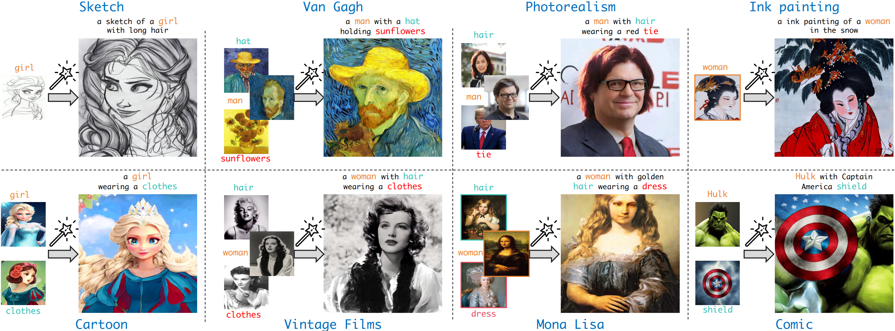
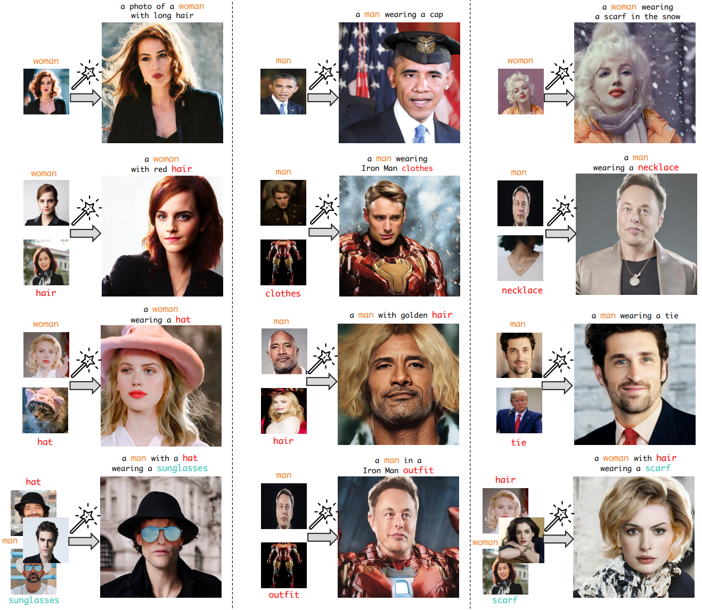

<h1>MagicFace: Training-free Universal-Style Human Image Customized Synthesis</h1>

[Yibin Wang](https://codegoat24.github.io)\*, [Weizhong Zhang](https://weizhonz.github.io/)\*, [Cheng Jin](https://cjinfdu.github.io/)&#8224; 

(*equal contribution, &#8224;corresponding author)

[Fudan University]

## 📖 Abstract

Existing human image personalized generation methods often require tedious training: either fine-tuning with a few images or retraining on large-scale datasets. 
In such cases, these methods are prone to overfitting and encounter difficulties when personalizing individuals of diverse styles. Moreover, these training-based approaches also struggle with multi-concept human image customizing. To this end, we propose MagicFace, the first method for universal-style human image personalized synthesis that enables single/multi-concept customization for humans of any style in a training-free manner. MagicFace introduces a coarse-to-fine generation pipeline, involving two sequential stages: semantic scene construction and concept feature injection. This is achieved by our Reference-aware Self-Attention (RSA) and Region-grouped Blend Attention (RBA) mechanisms. Specifically, 
in the first stage, RSA enables the latent image to query features from reference concepts simultaneously, extracting the coarse-grained overall semantic understanding to facilitate the initial semantic layout establishment. 
In the second stage, we employ a training-free semantic segmentation method to pinpoint the generated regions of all concepts in the latent image at each step. Following this, RBA divides the pixels of the latent image into semantic groups, with each group querying fine-grained features from its reference concept, which ensures precise attribute alignment and feature injection. Throughout the two-stage process, a weight mask strategy is employed to ensure the model focuses more on the reference concepts. 
Extensive experiments demonstrate our superiority in both human-centric subject-to-image synthesis and multi-concept human image customization. Our approach also can be applied to texture transformation, further enhancing its versatility and applicability.

## 🗓️ TODO
- [ ] Release inference code
- [ ] Release demo
- [ ] Release evaluation datasets
- [ ] Release evaluation code
- [ ] Release visualization code

## 🖼️ Visual results of MagicFace

