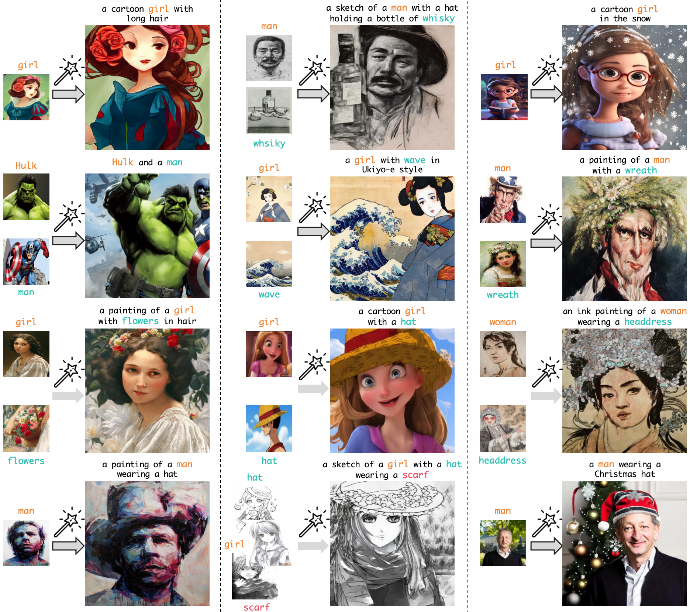

<div align="center">

<h1>MagicFace: Training-free Universal-Style Human Image Customized Synthesis</h1>

[Yibin Wang](https://codegoat24.github.io), [Weizhong Zhang](https://weizhonz.github.io/)&#8224;, [Cheng Jin](https://cjinfdu.github.io/)&#8224; 

(&#8224;corresponding author)

[Fudan University]

<a href="https://arxiv.org/pdf/2408.07433">
</a>
<a href="https://codegoat24.github.io/MagicFace/">
</a>

</div>


## Release
- [2024/12/16] 🔥🔥 We release the test **demo** for you to reproduce the results in our [paper](https://arxiv.org/pdf/2408.07433) !!
- [2024/12/16] 🔥🔥 We release the **inference** and **visualization** code !!
- [2024/11/18] 🔥 We update the figures and include inference time comparisons in the [paper](https://arxiv.org/pdf/2408.07433).
- [2024/08/15] 🔥 We release the [paper](https://arxiv.org/pdf/2408.07433).
- [2024/08/14] 🔥 We launch the [project page](https://codegoat24.github.io/MagicFace/).

## 📖 Abstract

<p>
Current human image customization methods leverage Stable Diffusion (SD) for its rich semantic prior. 
However, since SD is not specifically designed for human-oriented generation, these methods often require extensive fine-tuning on large-scale datasets, which renders them susceptible to overfitting and hinders their ability to personalize individuals with previously unseen styles.
Moreover, these methods extensively focus on single-concept human image synthesis and lack the flexibility to customize individuals using multiple given concepts, thereby impeding their broader practical application.
This paper proposes MagicFace, a novel training-free method for multi-concept universal-style human image personalized synthesis. 
Our core idea is to simulate how humans create images given specific concepts, i.e., first establish a semantic layout considering factors such as concepts' shape and posture, then optimize details by comparing with concepts at the pixel level. To implement this process, we introduce a coarse-to-fine generation pipeline, involving two sequential stages: semantic layout construction and concept feature injection. This is achieved by our Reference-aware Self-Attention (RSA) and Region-grouped Blend Attention (RBA) mechanisms.  
In the first stage, RSA enables the latent image to query features from all reference concepts simultaneously, extracting the overall semantic understanding to facilitate the initial semantic layout establishment. 
In the second stage, we employ an attention-based semantic segmentation method to pinpoint the latent generated regions of all concepts at each step. Following this, RBA divides the pixels of the latent image into semantic groups, with each group querying fine-grained features from the corresponding reference concept.
Notably, our method empowers users to freely control the influence of each concept on customization through a weighted mask strategy.
Extensive experiments demonstrate the superiority of MagicFace in both single- and multi-concept human image customization. 
</p>


### 🔨 Installation

```
conda create -n magicface python=3.10 -y
conda activate magicface
pip install -r requirements.txt
```
### 🚀  Customization
We prepare several test data across various styles in `./dataset` for you to reproduce the results in our paper. 

You only need to replace `./configs/config_stable_diffusion.yaml` with one of configuration files in the `./dataset/` folder, and run:
```
python magicface_stable_diffusion.py
```

**You also can customize images with your own data**:
- Prepare several reference images of concepts and using ([Grounded-Segment-Anything](https://github.com/IDEA-Research/Grounded-Segment-Anything)) to obtain their corresponding masks . Each concept require only a single reference image.
- Create a data directory and build the tree structure as below:
  ```
  data_directory
  ├── image
      ├── concept1.jpg
      ├── concept2.jpg
      ├── ...
  ├── mask              
      ├── concept1.jpg
      ├── concept2.jpg
      ├── ...         
  ```
  Ensure each concept's image and its corresponding mask have identical filenames.
- Modify the `./configs/config_stable_diffusion.yaml` file by updating the "ref_image_infos", "target_prompt", and "ref_index". 
Notably, "ref_index" is used to associate the reference images in "ref_image_infos" with their corresponding concept-specific tokens in "target_prompt".
- Run `python magicface_stable_diffusion.py`.
- Adjust the "seeds" and "mask_weights" in the ./configs/config_stable_diffusion.yaml to achieve optimal results.


## 🗓️ TODO
- ✅ Release inference code
- ✅ Release demo
- ✅ Release visualization code
- [ ] Release evaluation datasets
- [ ] Release evaluation code

## 📧 Contact
If you have any comments or questions, please open a new issue or feel free to contact [Yibin Wang](https://codegoat24.github.io).

## 🖊️ Citation
🌟 If you find our work helpful, please leave us a star and cite our paper.

```bibtex
@article{magicface,
  title={MagicFace: Training-free Universal-Style Human Image Customized Synthesis.},
  author={Wang, Yibin and Zhang, Weizhong, and Jin, Cheng},
  journal={arXiv preprint arXiv:2408.07433},
  year={2024}
}
```

## 🖼️ Visual results of MagicFace




# 🙏 Acknowledgements
We thank to [Stable Diffusion](https://github.com/CompVis/stable-diffusion), [MasaCtrl](https://github.com/TencentARC/MasaCtrl) and [Grounded-Segment-Anything](https://github.com/IDEA-Research/Grounded-Segment-Anything).
